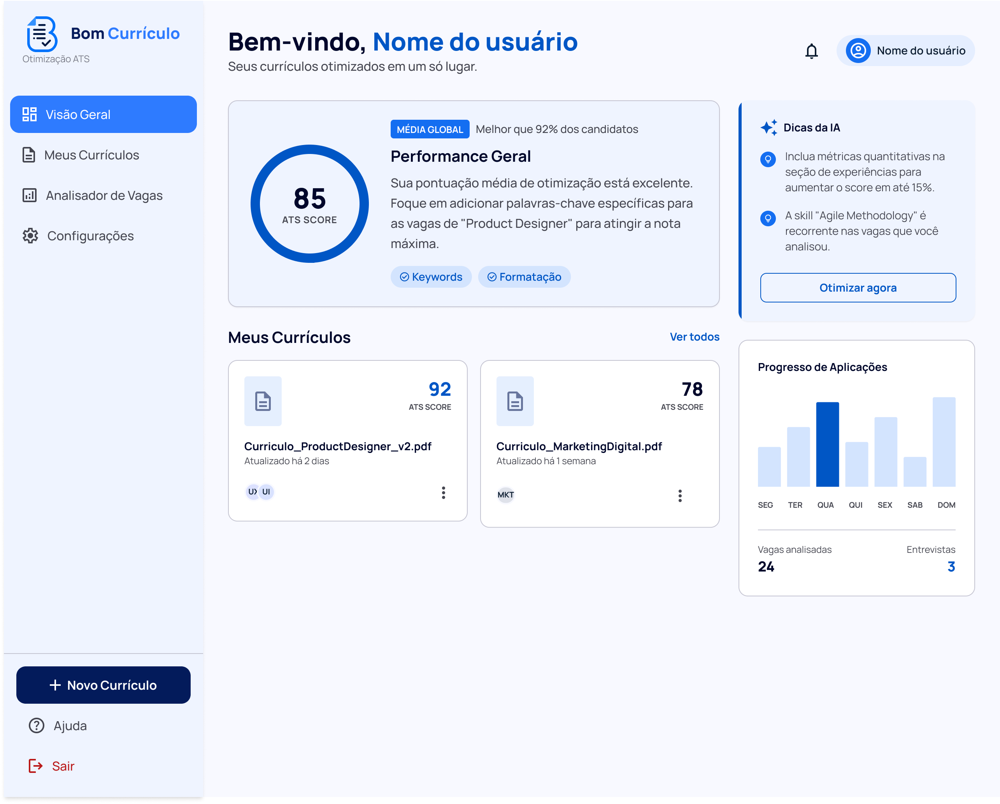

# Bom Currículo - ATS Resume Builder

https://bomcurriculo.tech

## UNDER CONSTRUCTION - EM CONSTRUÇÃO

Build ATS-friendly resumes using AI.

# English

## About

ATS Resume Builder is an open-source project that generates professional resumes optimized for Applicant Tracking Systems (ATS).

The system can use multiple optional sources of information, including:

- Current resume
- LinkedIn Profile (PDF export)
- GitHub profile
- Portfolio
- Personal information
- Target job description

The user does not need to provide every source. The only requirement is enough information to generate a resume.

## Features

- LinkedIn profile analysis
- GitHub profile analysis
- Portfolio analysis
- Job description matching
- ATS-friendly resume generation
- Resume optimization

## Screen prototype

An initial interface prototype was also developed in Figma to validate the user experience, feature organization, and the platform's main flow before final implementation.

The screens are still evolving, but they already represent the product's first visual proposal, including:

- Home page;
- User dashboard;
- Smart resume editor;
- Job analysis and compatibility;
- Resumes area;
- Authentication flow.

> **Note:** the design is still under development and may be adjusted as the product evolves.

[View prototype on Figma](PASTE_FIGMA_LINK_HERE)

## Roadmap

- [ ] Resume generation
- [ ] LinkedIn PDF parser
- [ ] GitHub integration
- [ ] Portfolio analysis
- [ ] Job matching
- [ ] Multiple templates
- [ ] Export to PDF
- [ ] Export to DOCX

## Contributing

Contributions are welcome!

Please read CONTRIBUTING.md before submitting a Pull Request.

## License

This project is licensed under the MIT License.

# Português

## Sobre

ATS Resume Builder é um projeto open source para geração de currículos profissionais otimizados para sistemas ATS.

O sistema pode utilizar diversas fontes opcionais de informação:

- Currículo atual
- Perfil do LinkedIn (PDF)
- Perfil do GitHub
- Portfólio
- Informações pessoais
- Vaga desejada

O usuário não precisa fornecer todas essas informações. Basta enviar dados suficientes para gerar um currículo.

## Funcionalidades

- Análise do LinkedIn
- Análise do GitHub
- Análise de portfólio
- Compatibilidade com vagas
- Geração de currículo ATS
- Otimização de currículo

## Protótipo das telas

Também foi desenvolvido um protótipo inicial da interface no Figma, com o objetivo de validar a experiência do usuário, a organização das funcionalidades e o fluxo principal da plataforma antes da implementação final.

As telas ainda estão em evolução, mas já representam a primeira proposta visual do produto, incluindo:

- Página inicial;
- Dashboard do usuário;
- Editor inteligente de currículo;
- Análise de vaga e compatibilidade;
- Área de currículos;
- Fluxo de autenticação.

> **Observação:** o design ainda está em desenvolvimento e poderá ser ajustado conforme a evolução do produto.

[Ver protótipo no Figma](COLE_AQUI_O_LINK_DO_FIGMA)

## Roadmap

- [ ] Geração de currículo
- [ ] Leitor de PDF do LinkedIn
- [ ] Integração com GitHub
- [ ] Análise de portfólio
- [ ] Correspondência de vagas
- [ ] Múltiplos modelos
- [ ] Exportação para PDF
- [ ] Exportação para DOCX

## Como contribuir

Leia o arquivo CONTRIBUTING.md.

## Licença

MIT License.
